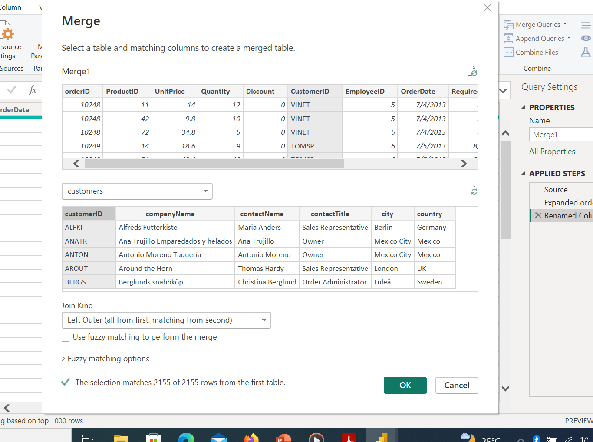
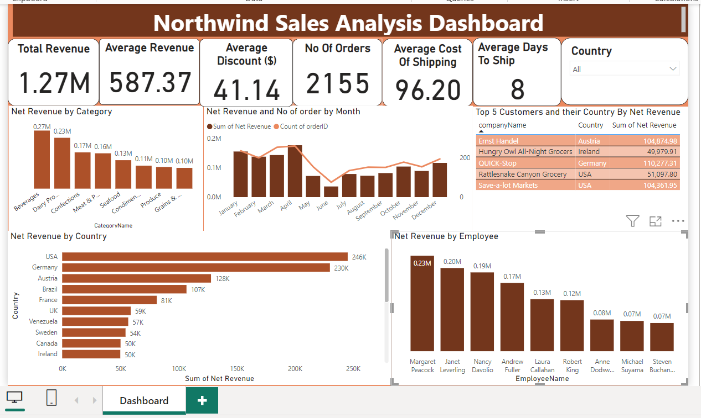

# NorthWind Traders Sales Analysis

## Introduction

This is a  Power Bi Project on  NorthWind Trader Sales Analysis.The Northwind dataset contains sales data for a fictitious company called Northwind Traders, which imports and exports specialty foods from around the world. This project is to analysis and derive insights to answer important questions and help the company make data driven decisions.

_Disclamier_**:_All Dataset do not represent any individual, Institution or company ,but just a dummy set to demonstrate my knowledge of Power Bi._

# Power Bi Concept applied :

1. Data cleaning and transformation
2. Dax Concept
3. Data Modelling

## Problem statement

1.  What is total revenue over the years ?
2. What is the average revenue growth rate for Northwind Traders over the years?
3. How long on average does it take to delivery goods?
4. What is the average discount giving.
5. What is average cost of shipping goods?
6. What is the breakdown for sales by product catergory
7. Analyse the revenue and order of goods Monthly.
7. What country generated the most revenue and the least revenue
8.  Who are Top five(5) customers and their countries
9. What is the employee perfomace in terms of genarating revenue.

## Data Sourcing

I came up with the about questions and went ahead to get the dataset. I downloaded the csv file,extracted it into Power Bi for cleaning,transformation,analysing and visualization

It contains seven (7) tables:

1. categories with 77 rows and 8 columns.
2. customers with 91 rows and 6 columns.
3. employees with 9 rows and 6 columns.
4. order details with 2155 rows and 5 columns.
5. orders with 830 rows and 8 columns.
6. products with 77 rows and 6 columns.
7. shippers with 3 rows and 2 columns.

## Data cleaning/Transformation

 I uploaded the datasets into the power query editor, and this steps where taken;

 . The data looks cleans ,so no much cleaning was done 
 
 . I check the column quality and column distribution of data data,everything was ok
 
 . I did some transformation by merging some tables together:
     
   Order_details + orders = Merge 1 on ordersId
   
        
   Merge 1 + customers = Merge 2 on  customersId
        
    
   Product + category = Merge 1 on categoryId,renamed to Product details
    
    
   Merge 2 + Product details = 3 on productId,renamed to Sales details

   ## DAX

   I created some columns in the sales details table that i created;

   1. Days To Ship = DATEDIFF(Sales_Details[OrderDate],Sales_Details[ShippedDate],DAY)
      
   2. To calculate the Net/Total Revenue, I had to calcuate:
   . Discount ($) = Sales_Details[Gross Revenue]* Sales_Details[Discount (%)]
      
   . Gross Revenue = Sales_Details[UnitPrice] * Sales_Details[Quantity]
      
  3.  Net Revenue = Sales_Details[Gross Revenue] -Sales_Details[Discount ($)]
      

## Data Modelling

Power Bi automatically connected the seven tables,but i had to connected the two i created the product detail and the Sales detail table. The Sales Detail table was the Fact table while the others are Dimensional Table.

## Data Analysis and Visuals
1. Total revenue across the countries is 1,270,000($)
   

2. The average revenue growth rate for Northwind Traders across the countries is 587.37($)

3. Average days  to delivery goods is 8 days

7. Average discount giving is 41.14($)

8. Average cost of shipping goods is Average(freight) = 96.20($)

9. Breakdown for sales by product catergory.

10. Analyse the revenue and order of goods Monthly.

11. Country that generated the most revenue and the least revenue.

 
12. Top five(5) customers and their countries

13. Employee perfomace in terms of genarating revenue.

The Northwind Traders Sales Dashboard

## Conclusion And Recommendation
. It takes 8 days on average to delivery goods, the days are too much.It should be look into.
. Most Revenue and order is generated in April while june has the lowest sales.
. Beverage is the category of product that generated the most revenue.
. Margaret Peacock generated more than 200000($),while Steven Buchanan did not generate uo to 10000($).Margaret should be commended while steven should be giving a set target.
. The Average revenue is 587 while average cost of shipping is 96.20. I feel a better,cheaper and faster shipping company should used for shipping the goods.
. USA genrated most revenue while canada generated the least.

